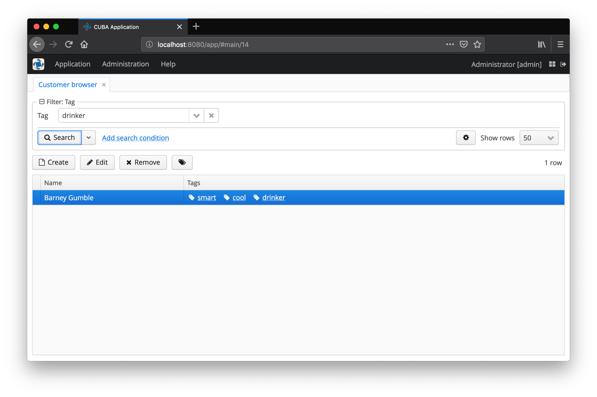
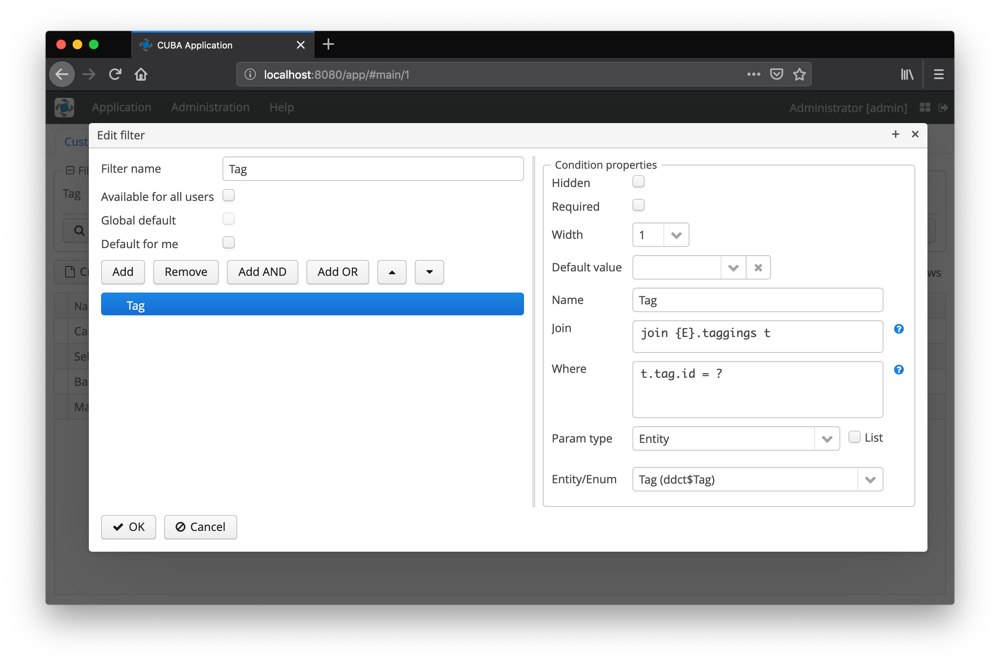

[](http://www.apache.org/licenses/LICENSE-2.0)


[](https://github.com/mariodavid/jmix-taggable/releases/)
[](https://github.com/mariodavid/jmix-taggable-example)
[](https://www.jmix.io/marketplace/taggable)


# Jmix Taggable

This add-on lets you enhance your entities with a tagging functionality, without introducing a dedicated entity model.

Example: Product 
* "Apple iPhone" has Tags "cool", "small", "expensive"
* "Apple iPad" has Tags "big", "cheap", "clumsy"

all managed & assigned by users.


Add the dependency to your project:

```groovy
dependencies {
  implementation 'de.diedavids.jmix.taggable:jmix-taggable-starter:*addon-version*'
}
```

NOTE: If you are updating from CUBA Platform, see [Migration from CUBA](#migration-from-cuba).

## Example Usage

To see this add-on in action, check out this example: [jmix-taggable-example](https://github.com/mariodavid/jmix-taggable-example).

### CHANGELOG

Information on changes that happen through the different versions of the add-on can be found in the [CHANGELOG](CHANGELOG.md).
The Changelog also contains information about breaking changes and tips on how to resolve them.

## Using the add-on

In order to use the add-on, you need to implement the marker interface in all your entities that should support tags:

````java
import de.diedavids.jmix.taggable.entity.Taggable;

@JmixEntity
@Table(name = "CUSTOMER")
@Entity
public class Customer implements Taggable {
    
    // ...
    
}
````

After that your entities already support tagging. The add-on also provides a UI for managing those Tags for your entities:

```java
class CustomerBrowse extends StandardLookup<Customer> implements WithTagsSupport {

    @Inject
    private GroupTable<Customer> customersTable;

    @Inject
    private ButtonsPanel buttonsPanel;

    @Override
    Table getListComponent() {
        return customersTable;
    }

    @Override
    ButtonsPanel getButtonsPanel() {
        return buttonsPanel;
    }

}
```

### Configuration options

With that your `Customer` entity will be taggable and might look like the following:

The following options are available for the Annotation / Interface:

* `listComponent` - the list component the tagging functionality should be placed upon (normally the Table of the browse screen
* `showTagsInList` - this option will create a column in the table and renders all tags for the corresponding row
* `showTagsAsLink` - renders the tags as links, which open screen that displays all entities that are tagged with this link
* `tagLinkOpenType` - configures the open type of the tag link screen (only applicable if `showTagsAsLink` = true)
* `persistentAttribute` - if a persistent attribute in a subclass of `Tagging` is used for faster data access, it can be defined to be used here
* `tagContext` - a string that identifies the context of this tag usage


## JPA interactions with Tag entity

With the plain use of the `WithTagsSupport` interface, it is not directly possible to use the Tag entity within the JPA layer alongside with your entities.

One example of this restriction is the filter component to filter all entries (like Customers) for a given tag. Also, programmatic joins from business entities to `Tag` is by default not possible. The reason is that in order to do that, the JPA layer needs to know about the relationship between a `Tagging` (one entity within this add-on) and the entity to filter for (e.g. `Customer`).


But it is possible to enable this kind of interaction with the `Tagging` entity by extending it and making the entity aware of the relationships.

### Extending Tagging Entity

In the application you have to create an Entity that extends `Tagging` and uses the `@Extends` annotation from Jmix to replace the original entity with the new subclass.

```java
import de.diedavids.jmix.taggable.entity.Tagging;

@Extends(Tagging.class)
@Entity(name = "myApp_ExtendedTagging")
public class ExtendedTagging extends Tagging {
    private static final long serialVersionUID = 6795917365659671988L;

    @ManyToOne(fetch = FetchType.LAZY)
    @JoinColumn(name = "CUSTOMER_ID")
    protected Customer customer;

    public void setCustomer(Customer customer) {
        this.customer = customer;
    }

    public Customer getCustomer() {
        return customer;
    }

}
```

With that it is possible to create an additional reference from the Customer entity to the Tagging entity like this:

```java
@Table(name = "MYAPP_CUSTOMER")
@Entity(name = "myApp$Customer")
public class Customer {
    private static final long serialVersionUID = 2263337300282568L;

    @InstanceName
    @Column(name = "NAME")
    protected String name;

    @OneToMany(mappedBy = "customer")
    protected List<ExtendedTagging> taggings;

    public void setName(String name) {
        this.name = name;
    }

    public String getName() {
        return name;
    }

    public List<ExtendedTagging> getTaggings() {
        return taggings;
    }

    public void setTaggings(List<ExtendedTagging> taggings) {
        this.taggings = taggings;
    }

}
```

### Using persistentAttribute option in WithTagsSupport

The second step is then to define the `persistentAttribute` in the usage of the `WithTagsSupport` interface like this:

```java
class CustomerBrowse extends StandardLookup<Customer> implements WithTagsSupport {

    @Override
    public String getPersistentAttribute() {
        return "customer";
    }
}
```

With that configuration in place, the persistent reference attribute will also be used to store the reference from the `Tagging` entity to the customer entity. When the Tagging functionality is used for multiple different entities, each of those entities can get a different persistent
Attribute in the `ExtendedTagging`.

Now it is possible to use e.g. the filter functionality of CUBA directly, to search e.g. for all Customers that are tagged with a particular tag.






## Scope Tags with Contexts

By default, the created tags in the application are available for selection in all contexts. So if both a `Customer` and a `Order` entity both use the Tag functionality, a new Tag that is entered in the context of the Customer browse screen, the same Tag will also be available
for selection in the context of the Order browse screen.

This global behavior might not always be desired. Therefore, there is an option to set a String identifier called `tagContext` that will scope the Tags that are available for selection for only this context.

In the example above, it is possible to scope the available tags for the customer use case to only be available within this screen:

```java
class CustomerBrowse extends StandardLookup<Customer> implements WithTagsSupport {

    @Override
    public String getPersistentAttribute() {
        return "customer";
    }
}
```

The scope might not only be applicable on a per-entity basis, but also for different use-cases for one Entity it is possible to define different contexts on a per-screen basis.


